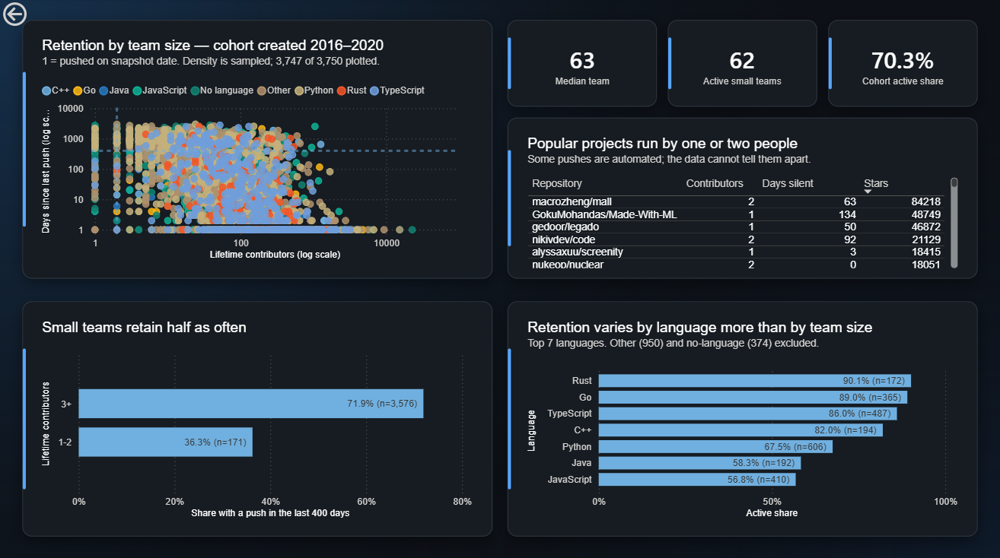
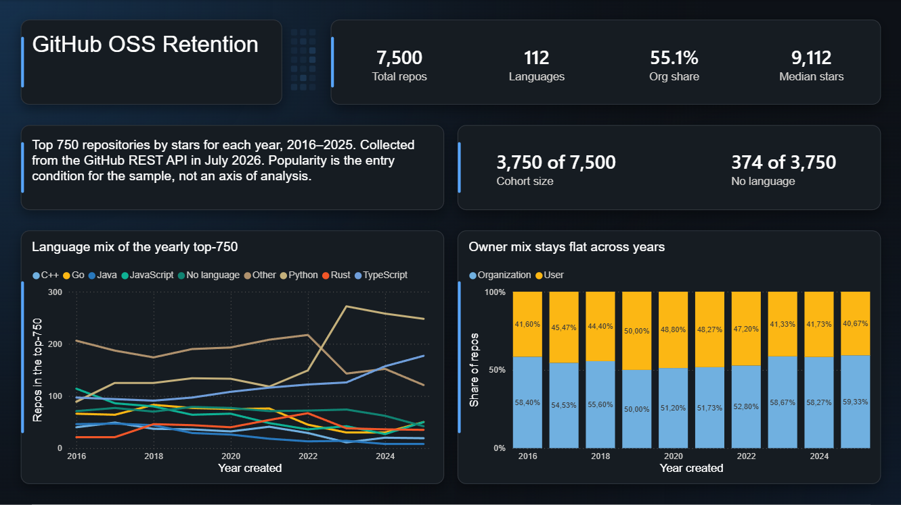
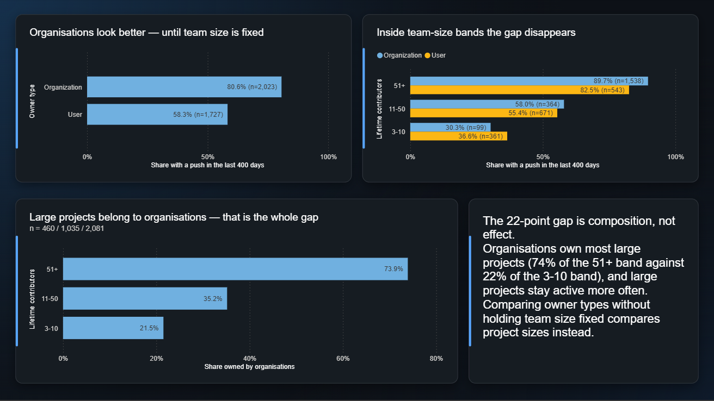

# GitHub OSS Retention

What keeps already-popular open-source repositories alive over time — and does survival
depend on team size?

Data collected from the GitHub REST API, processed through SQLite, analysed in Power BI.
Sample: the top 750 repositories by stars for each year from 2016 to 2025 (7,500 total),
snapshot taken 2026-07-17.

---

## Results

**Small teams retain half as often.** Among repositories created up to 2020, projects with
one or two lifetime contributors are still active 36.3% of the time (62 of 171) against
71.9% for everyone else (2,575 of 3,579) — a gap of 35.6 points. The gap stays between 31
and 36 points across both cohort cutoffs tested (2019/2020) and both activity thresholds
(400/700 days), so it does not rest on where either line was drawn.

Popular projects maintained by one or two people do exist — 62 of them are still active,
and the dashboard lists them by name — but as a class they retain markedly worse than team
projects.

**Language spreads wider than team size.** Retention by language runs from Rust at 90.1%
down to JavaScript at 56.8% — 33 points, wider than the result above. Two competing
explanations were tested and rejected: language age accounts for about 4 of the 33 points,
and the ordering survives stratification by team size, with Rust and Go staying ahead of
JavaScript and Jupyter Notebook by 21–27 points inside every contributor band.

**Organisations do not retain better — that gap is composition.** Naively, repositories
owned by organisations are active 80.6% of the time against 58.3% for individuals: a
22-point gap. Holding team size fixed, it collapses to 7.2 points in the 51+ band, 2.6 in
11–50, and reverses to −6.3 in 3–10. The mechanism is ownership skew: organisations own
73.9% of large projects but only 21.5% of small ones, and large projects stay active more
often. Pooling the two reports project size, not owner type.



---

## Why the question is not trivial

The sample is the top 750 by stars per year. That makes popularity the **entry condition**
for the sample rather than a variable inside it — every repository here is popular by
construction, so popularity cannot distinguish anything. Analysing by the variable the
sample was selected on is the mistake this project is built to avoid.

Retention is therefore reconstructed from two signals the star filter does not flatten:

| signal | field | reading |
|---|---|---|
| activity | `pushed_at` → `days_since_push` | was there a push recently |
| team | contributor count | one maintainer or a group |

Both are proxies read off a single snapshot, not trajectories — the API returns no history.
A push can come from a dependency bot; a contributor count includes everyone who ever
committed. Neither signal carries the class alone, which is why it rests on both: 36% of
small teams are active while 28% of larger ones are silent, so the two disagree often
enough to be worth crossing.

Young repositories are excluded entirely. A repository created in 2024 is active because
it is new, not because it retained anything.

---

## Dashboard

Three pages, built on a star schema — `repositories` as the fact table, `owners` and
`languages` as dimensions.

| page | content |
|---|---|
| **Overview** | sample composition — language mix per year, owner mix per year, what enters the retention analysis |
| **Retention** | main scatter (contributors × days silent, both log), retention gap by team size, retention by language, the 42 solo-maintained projects by name |
| **Ownership** | the false organisation effect and its mechanism |




The main scatter colours points by language rather than by retention class deliberately:
the class is a deterministic function of both axes, so colouring by it would display the
position of the thresholds and nothing else. The class boundaries stay on the chart as
annotation lines, which is what they are.

---

## Stack

- **Collection** — Python (`requests`), GitHub REST API with a fine-grained PAT, rate-limit
  handling for both the search endpoint (30/min) and core endpoints (5,000/hour)
- **Storage** — SQLite, star schema
- **Processing** — SQL for derived fields and classification
- **Visualisation** — Power BI Desktop over ODBC

The contributor pass takes about three hours across 7,500 repositories, so it is
crash-resumable: the output file doubles as the progress journal, and a line only counts
as done if both fields are present and the value parses. A process killed mid-write leaves
`owner/repo,` behind, and accepting that would mark the repository done while losing its
value silently.

Contributor counts are read from the last-page number of a paginated request rather than by
downloading the list, with `anon=true` so that commits from unlinked email addresses are
counted. Without it, older repositories — which are exactly the retention cohort — would be
undercounted along the main axis of the analysis.

---

## How to run locally

```
git clone https://github.com/yaroslav-hezei/github-oss-retention.git
cd github-oss-retention
pip install requests python-dotenv
```

Or, using [uv](https://github.com/astral-sh/uv) for reproducible installs from the lock file:

```
git clone https://github.com/yaroslav-hezei/github-oss-retention.git
cd github-oss-retention
uv sync
```

Put a GitHub personal access token in `.env` (see `.env.example`), then run the pipeline in
order:

```
python src/collect/repos.py           # raw JSON per year → data/raw/
python src/collect/prepare_repos.py   # 7,500 repository names
python src/collect/contributors.py    # contributor counts (~3 hours)
python src/db/init_db.py              # schema from sql/schema.sql
python src/db/load.py                 # raw + contributors → SQLite
python src/db/derive.py               # created_year, age_days, days_since_push
python src/db/classify.py             # retention_class
```

Prefix each command with `uv run` if using uv. Every pass communicates through files on
disk rather than function calls, so any step can be rerun independently.

The database is excluded from the repository and delivered through GitHub Releases. The
`.pbix` holds an imported copy of the data, so the dashboard opens and displays without it.

---

## Limitations

Full reasoning with figures is in [`data/FINDINGS.md`](data/FINDINGS.md).

- **Retention is a proxy from a snapshot**, reconstructed from two signals, not a
  trajectory. The API returns no history.
- **The cohort cutoff is an assumption, not a finding.** The share of silent repositories
  keeps rising all the way to the oldest cohort under all three rulers tested — no plateau
  exists, so the point at which a repository becomes judgeable cannot be read off the data.
  The result above is insensitive to moving the cutoff to 2019.
- **"Small team" is a definition, not a boundary in the data.** Per-value density falls
  monotonically across the whole range, with no gap or shoulder. The 1–2 line was chosen
  because its interpretation is beyond dispute, not because the data marks it.
- **Contributor count is cumulative**, covering everyone who ever committed rather than the
  team working today. A long-lived solo project stops looking solo once a handful of
  drive-by contributors have passed through. Both readings of the thinning lower edge — that
  solo projects die, and that they stop being measurable as solo — fit the same data.
- **The sample entry bar is not constant.** The 750th repository of 2016 has 7,055 stars
  against 3,807 in 2022. Older cohorts were selected roughly twice as strictly — and the
  effect runs against the observed trend, since more strictly selected repositories turn out
  to be the quieter ones.
- **The class of active small teams is heterogeneous.** Reviewing all 62 by description
  found single-maintainer libraries alongside curated lists, and three repositories that
  push on a schedule rather than by hand. No field distinguishes automated pushes; others
  may remain undetected.
- **The upper third of the activity axis is censored.** A repository cannot have been silent
  longer than it has existed, so above 2,023 days only the older part of the cohort can
  appear. Classification is unaffected — the 400-day threshold sits far below — but the
  distortion is visible on the scatter, where 1.9% of the points sit.
- **The language ranking was tested at its ends, not its middle.** Rust, Go, JavaScript and
  Jupyter Notebook passed stratification; Python, TypeScript, Java and C++ enter the palette
  by repository count without their rank being checked for robustness.
- Findings describe the most popular repositories on GitHub, not GitHub as a whole.
- Two anomalies are recorded without explanation: 2017 is quieter than both its neighbours
  under every ruler, and the 2023 entry bar spikes to 5,163 stars against roughly 3,850
  either side.

---

## Repository

```
src/step0/     feasibility check, run before any collection
src/collect/   repos.py, prepare_repos.py, contributors.py
src/db/        init_db.py, load.py, derive.py, classify.py
sql/           schema.sql, derive.sql, retention.sql, exploration.sql
data/          FINDINGS.md, step0/CONCLUSION.md
screenshots/   dashboard pages
```

Before a line of the collector was written, roughly 150 calls against the search endpoint's
`total_count` tested whether a retention cut by language would have enough repositories per
cell in the old cohort — the search API returns that number without downloading any
repositories, so the check cost nothing. The concern was that young languages (Rust,
TypeScript, Go) would be missing from the 2016–2020 cohort; all three cleared the threshold
comfortably. The only casualty was Ruby, with 9 qualifying repositories across five years,
which was dropped from the language cut before any pipeline existed. Details in
[`data/step0/CONCLUSION.md`](data/step0/CONCLUSION.md).